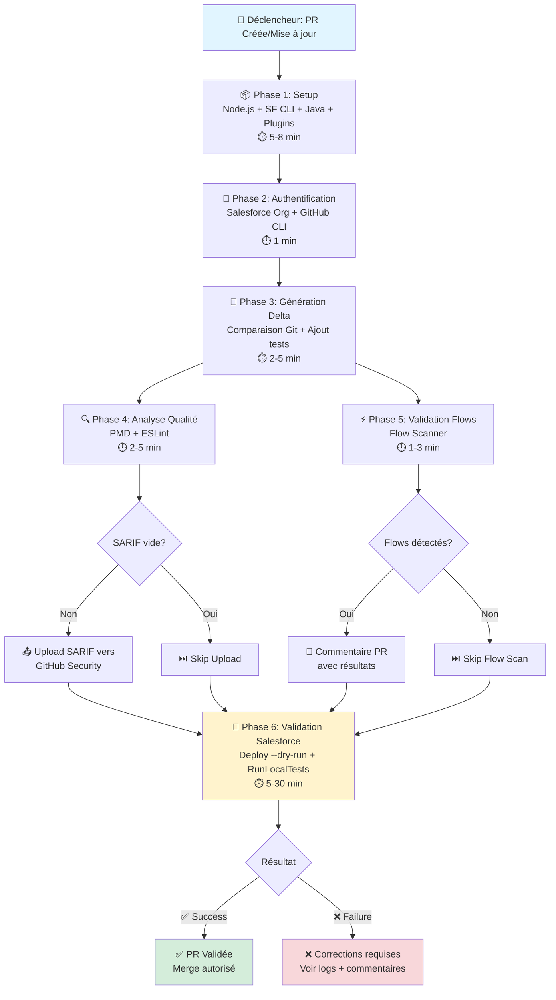
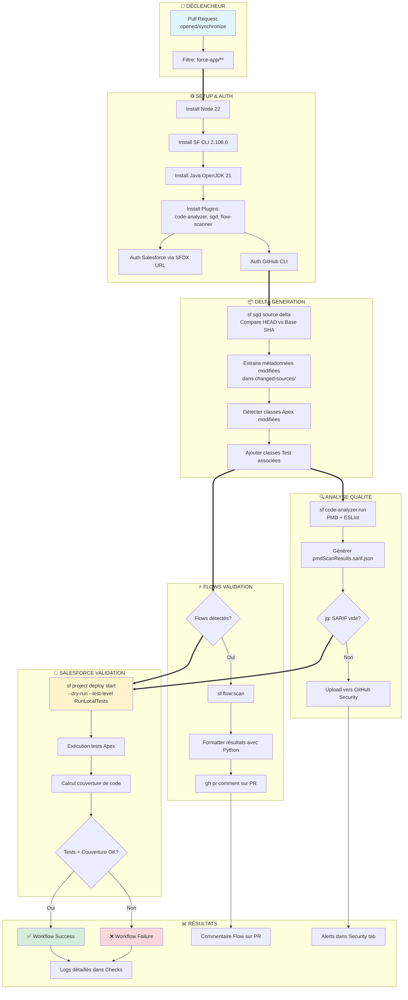
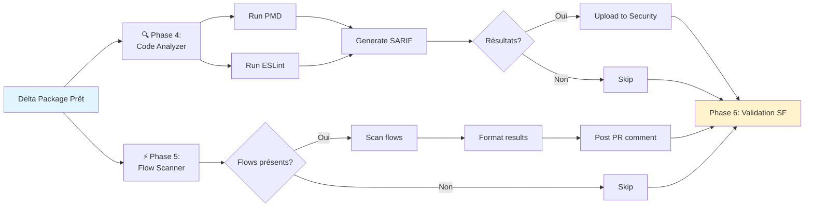
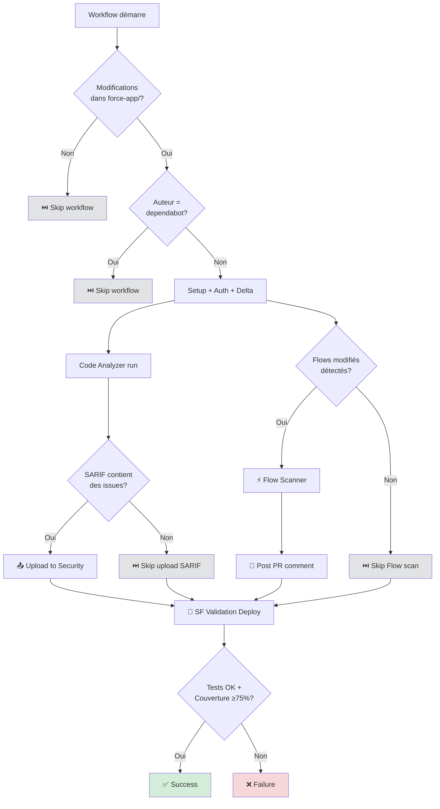
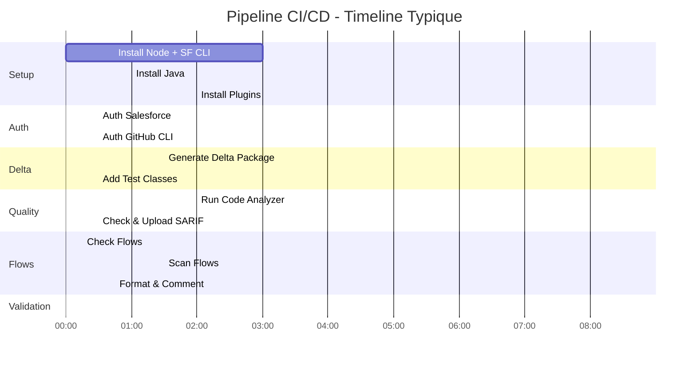

# Pipeline CI/CD Salesforce - Schémas Visuels

Ce document présente les schémas visuels illustrant l'architecture et le flux du pipeline CI/CD.

---

## Schéma 1 : Vue d'ensemble simplifiée



**Durée totale moyenne** : 10-20 minutes
**Durée maximale** : ~30 minutes (selon la taille des tests)

---

## Schéma 2 : Flux détaillé par composants



---

## Schéma 3 : Traitement parallèle Phase 4 & 5



---

## Schéma 4 : Architecture des outils

```mermaid
graph TB
    subgraph "🛠️ OUTILS INSTALLÉS"
        N[Node.js 22<br/>Runtime JavaScript]
        SF[Salesforce CLI 2.108.6<br/>Commandes sf]
        J[Java OpenJDK 21<br/>Requis pour PMD]
    end

    subgraph "🔌 PLUGINS SF"
        P1[@salesforce/plugin-code-analyzer<br/>v5.5.0]
        P2[sfdx-git-delta<br/>v6.22.0]
        P3[lightning-flow-scanner<br/>v5.7.2]
    end

    subgraph "🔧 OUTILS SYSTÈME"
        GH[GitHub CLI<br/>gh]
        GIT[Git<br/>Avec historique complet]
        JQ[jq<br/>Parser JSON]
        PY[Python 3<br/>Scripts formatage]
    end

    N -.-> SF
    J -.-> P1
    SF --> P1
    SF --> P2
    SF --> P3

    P1 --> |Analyse| CODE[Code Apex/JS]
    P2 --> |Delta| DELTA[Package XML]
    P3 --> |Scan| FLOWS[Flows]

    GH --> |Commentaires| PR[Pull Request]
    JQ --> |Parse| SARIF[Fichiers SARIF]
    PY --> |Format| RESULTS[Résultats Flow]

    style SF fill:#00A1E0
    style CODE fill:#d4edda
    style FLOWS fill:#d4edda
    style DELTA fill:#d4edda
```

---

## Schéma 5 : Décisions conditionnelles



---

## Schéma 6 : Timeline typique (durées moyennes)



**Légende des durées** :
- ⚡ Rapide : < 2 min
- ⏱️ Moyen : 2-5 min
- 🐢 Long : 5-30 min (dépend du nombre de tests)

---

## Récapitulatif des 6 phases

| Phase | Nom | Durée | Outils clés | Condition |
|-------|-----|-------|-------------|-----------|
| **1** | Setup | 5-8 min | Node, SF CLI, Java, Plugins | Toujours |
| **2** | Authentification | 1 min | SFDX URL, gh CLI | Toujours |
| **3** | Delta Generation | 2-5 min | sfdx-git-delta | Toujours |
| **4** | Analyse Qualité | 2-5 min | code-analyzer, jq | Toujours |
| **5** | Flow Validation | 1-3 min | flow-scanner, Python | Si flows détectés |
| **6** | SF Validation | 5-30 min | sf deploy, Apex tests | Toujours |

**Total** : 15-52 minutes (moyenne : 18 minutes)

---

## Points clés à retenir

### ✅ Optimisations implémentées
- **Delta deployment** : Seules les métadonnées modifiées sont validées
- **Upload SARIF conditionnel** : Évite les uploads inutiles si aucune issue
- **Flow scan conditionnel** : Skip si aucun flow modifié
- **Tests auto-inclusion** : Les classes de test sont ajoutées automatiquement
- **Commentaire éditable** : Un seul commentaire mis à jour au lieu de multiples

### 🎯 Sorties du pipeline
1. **Logs détaillés** → Onglet "Checks" de la PR
2. **Commentaire Flow** → Directement dans la PR
3. **Alertes Security** → Onglet Security du repo
4. **Statut final** → ✅ Success ou ❌ Failure

### ⚡ Performance
- Temps moyen : **15-20 minutes**
- Temps min : **10 minutes** (petit changement, peu de tests)
- Temps max : **30+ minutes** (gros changement, nombreux tests)

---

**Document créé le** : 2025-11-04
**Complément de** : PIPELINE_CI_DOCUMENTATION_CONFLUENCE.md
